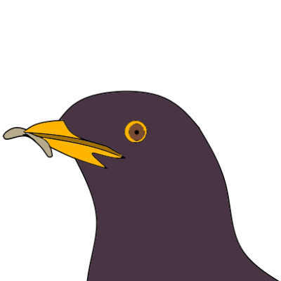
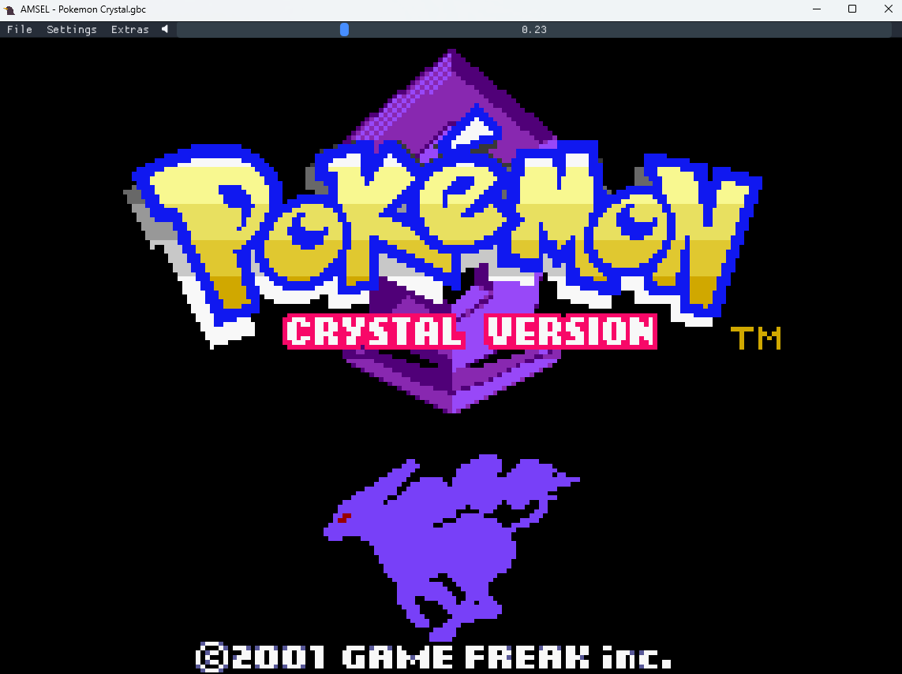
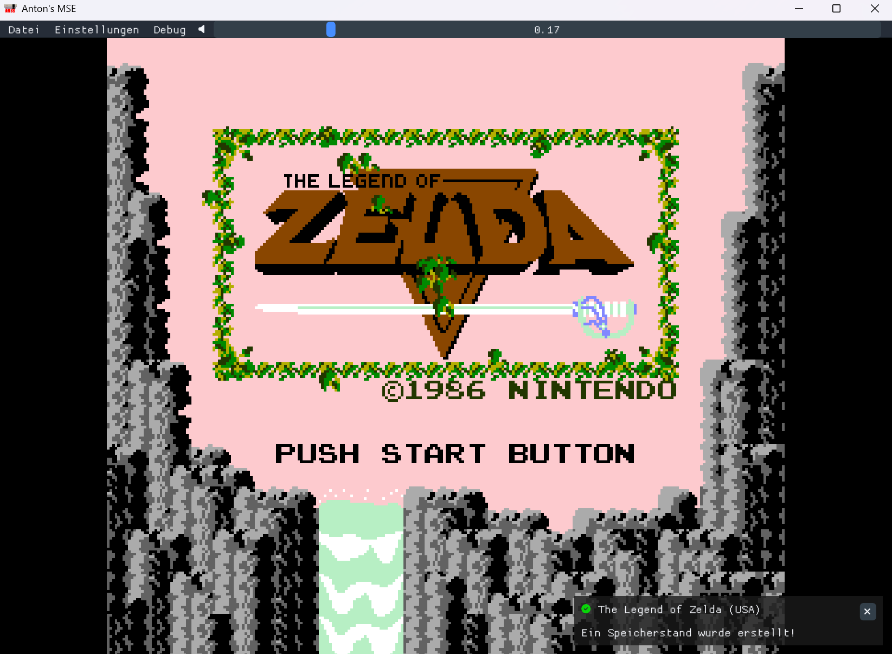
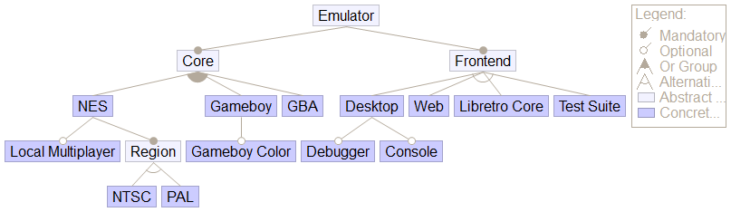

# Antons Multi-System-Emulator (AMSEL)

Cross-Plattform emulator product line in C++ (NES, DMG, CGB, GBA)


   

## Systems and Compatibility
### Nintendo Entertainment System
- Behaviour was developed conforming to NTSC, added experimental PAL setting
- Most common Mappers implemented (MMC1, UxROM, CNROM, (MMC3), AxROM)
- MMC3 implementation is incomplete with simplified IRQ timing, some games have visual glitches
### Nintendo Gameboy Color (amd dmg)
- DMG games are in black and white
- Most mappers implemented (MBC1, MBC2, MBC3, MBC5)
- RTC is missing
- Some games require very strict DMA timing and don't work correctly because of it
### Nintendo Gameboy Advance (incomplete)
- Working CPU and Bus
- Passes ARMWrestler, arm.gba and thumb.gba by jsmolka, most SingleStepTests
- PPU mode 3 and 4 working (bitmap modes), mode 0 backgrounds
- No audio yet
- Timings, Waitstates not implemented
- EEPROM, Flash not implemented
- Performance is weak
- TODO

## Features
- Persistent settings (Volume, keybinds, language, etc.)
- Persistent savegames
- Debugger / Disassembler
- Local multiplayer (NES)
- Gamepad support
- CRT-Shader
- Localization using JSON files (german, english included)
- React web interface, includes smartphone layout

## Structure
The project is mostly written in C++. The individual consoles are decoupled from the interface, making the emulator easily extensible in theory, however some parts currently assume a NES / gameboy layout. The desktop frontend is implemented in Dear ImGui, running in an OpenGL 4.6 context.

I implemented the gameboy emulator in a separate project at first to learn Rust, which is why it's written in that language. To include it here, I defined a FFI in Rust CXX. Using Corrosion in Cmake it's trivial to then include it in an existing C++ project.

The web app frontend is written in React / Typescript. The emulator defines a javascript interface and is then compiled using emscripten to webassembly.


The entire project is developed as a Software Product Line (SPL). Individual features are able to be set at configure time as CMake options to create valid products according to the feature model <a href="https://en.wikipedia.org/wiki/Feature_model">(see here)</a>. The solution space is realized as a mix of preprocessor annotations and build system to create variability.

# Build

requires CMake.
requires Python 3 for building glad.
requires Rust and Cargo for the Gameboy part.

building:
```
cd build
python -m venv .venv
.venv/Scripts/activate.<ps1/bat/sh...>
python -m pip install jinja2
cmake ..
make
```
## building the web app

requires Emscripten and npm.

```
emcmake cmake .. -DFEATURE_WEB=ON -DFEATURE_DESKTOP=OFF
make
```
then in src/web:
```
npm install
npm run dev         (start dev server)
npm run build       (build website for delivery)
```

## building as Libretro core

On windows, has to be built with MSVC in order to work with standard releases of retroarch.

```
cmake .. -DFEATURE_LIBRETRO_CORE=ON -DFEATURE_DESKTOP=OFF
```

Then use appropriate build tool.

## running the tests

```
cmake .. -DFEATURE_TEST_SUITE=ON
make test
```
