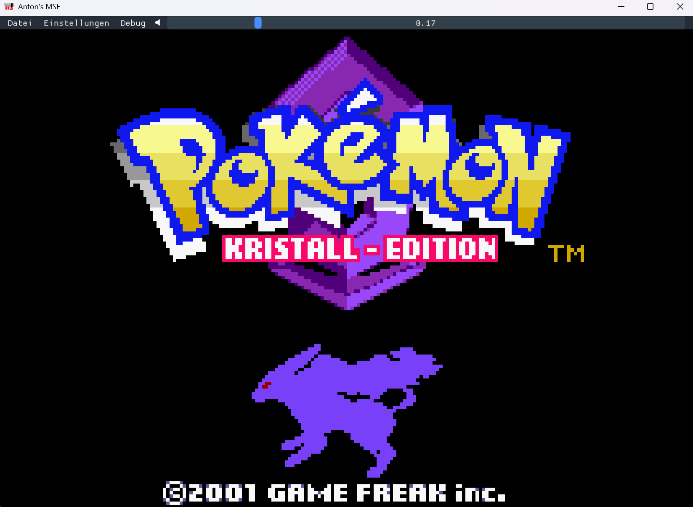

# Antons Multi-System-Emulator (AMSEL)

Cross-Plattform Multi-System-Emulator in C++ (NES, DMG, CGB)


   

## Systeme und Kompatibilität
### Nintendo Entertainment System
- Verhalten ist an NTSC abgestimmt, experimenteller PAL-Modus
- Die häufigst verwendeten Mapper sind implementiert (MMC1, UxROM, CNROM, (MMC3), AxROM)
- MMC3 implementierung ist unvollständig mit stark vereinfachtem IRQ Timing, manche Spiele laufen wenn überhaupt nur mit visuellen Glitches
### Nintendo Gameboy Color (unterstützt auch originale Gameboy-Spiele)
- DMG Spiele laufen nur in schwarz-weiß
- Die meisten Mapper sind implementiert (MBC1, MBC2, MBC3, MBC5)
- Die Echtzeituhr von entsprechenden Cartridges ist aktuell noch nicht implementiert
- Einige wenige Spiele funktionieren aufgrund von obskuren DMA Timings nicht korrekt
### Nintendo Gameboy Advance (in Arbeit)
- TODO

## Features
- Persistente Einstellungen (Lautstärke, Tastenbelegungen, Sprache, etc.)
- Persistente Speicherstände
- Visueller Debugger / Disassembler
- Lokaler Mehrspieler (NES)
- Gamepad-Unterstützung
- CRT-Shader
- Lokalisierung über JSON-Dateien (standardmäßig deutsch, englisch)
- React-Weboberfläche, ermöglicht Nutzung auf Smartphones

## Aufbau
Das Projekt ist zum Großteil in C++ geschrieben. Die einzelnen Konsolen sind größtenteils von der Benutzeroberfläche entkoppelt, dadurch lässt sich das Programm auch zumindest theoretisch leicht erweitern, allerdings gehen einige Teile der Benutzeroberfläche noch strikt von einem NES / Gameboy aus (z.B. Tastenbelegungen).
Die Benutzeroberfläche ist aktuell in Dear ImGui implementiert, das ganze Desktop-Frontend läuft in einem OpenGL-Kontext.

Den Gameboy-Emulator hatte ich zuerst in einem eigenständigen Projekt in Rust implementiert, um die Sprache zu lernen. Anschließend habe ich in dem Projekt ein Foreign Function Interface zu C++ mit Rust CXX gebaut, um es in das NES-Projekt zu integrieren. Mit Corrosion lässt sich ein Rust-Paket mit CXX sehr leicht in ein vorhandenes CMake-Skript eingliedern.

Für die Web-App definiert der Emulator eine Javascript-Schnittstelle und wird mit Emscripten kompiliert.
Die Oberfläche selbst ist in React / Typescript geschrieben.


Der Emulator wurde als Software-Produktlinie (SPL) entwickelt. Die einzelnen Features lassen sich beim kompilieren als CMAKE-Optionen setzen und entsprechend des Feature-Modells gültige Produkte erzeugen. Im Lösungsraum habe ich eine Kombination aus Preprozessor und Build-System verwendet, um die Variabilität herzustellen.

# Build

Erfordert CMake.
Erfordert Python 3 für das Bauen von glad.
Erfordert Rust bzw. Cargo für den Gameboy-Teil.

Bauen:
```
cd build
python -m venv .venv
.venv/Scripts/activate.<ps1/bat/sh...>
python -m pip install jinja2
cmake ..
make
```
## Bauen der Web-App

Erfordert Emscripten und npm.

```
emcmake cmake .. -DFEATURE_WEB=ON -DFEATURE_DESKTOP=OFF
make
```
Dann in source/web/amsel-web:
```
npm install
npm run dev         (startet Entwicklungsserver)
npm run build       (Baut Webseite für Auslieferung)
```

## Bauen des Libretro-Core

Muss auf Windows mit MSVC gebaut werden, falls der Core mit den Standard-Releases von Retroarch funktionieren soll.

```
cmake .. -DFEATURE_LIBRETRO_CORE=ON -DFEATURE_DESKTOP=OFF
```

Dann entsprechendes Build-Werkzeug verwenden.

## Ausführen der Tests

```
cmake .. -DFEATURE_TEST_SUITE=ON
make test
```
